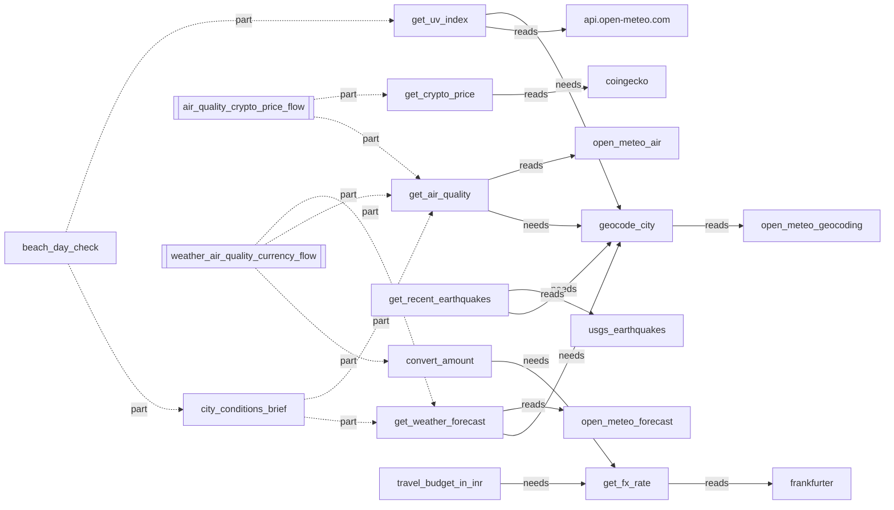

```mermaid
graph LR
  geocode_city[geocode_city]
  get_weather_forecast[get_weather_forecast]
  get_air_quality[get_air_quality]
  get_fx_rate[get_fx_rate]
  convert_amount[convert_amount]
  get_recent_earthquakes[get_recent_earthquakes]
  get_crypto_price[get_crypto_price]
  city_conditions_brief[city_conditions_brief]
  air_quality_crypto_price_flow[[air_quality_crypto_price_flow]]
  weather_air_quality_currency_flow[[weather_air_quality_currency_flow]]
  get_uv_index[get_uv_index]
  travel_budget_in_inr[travel_budget_in_inr]
  beach_day_check[beach_day_check]
  geocode_city -->|reads| open_meteo_geocoding
  get_weather_forecast -->|needs| geocode_city
  get_weather_forecast -->|reads| open_meteo_forecast
  get_air_quality -->|needs| geocode_city
  get_air_quality -->|reads| open_meteo_air
  get_fx_rate -->|reads| frankfurter
  convert_amount -->|needs| get_fx_rate
  get_recent_earthquakes -->|needs| geocode_city
  get_recent_earthquakes -->|reads| usgs_earthquakes
  get_crypto_price -->|reads| coingecko
  city_conditions_brief -.->|part| get_weather_forecast
  city_conditions_brief -.->|part| get_air_quality
  air_quality_crypto_price_flow -.->|part| get_air_quality
  air_quality_crypto_price_flow -.->|part| get_crypto_price
  weather_air_quality_currency_flow -.->|part| convert_amount
  weather_air_quality_currency_flow -.->|part| get_air_quality
  weather_air_quality_currency_flow -.->|part| get_weather_forecast
  get_uv_index -->|reads| api.open-meteo.com
  get_uv_index -->|needs| geocode_city
  travel_budget_in_inr -->|needs| get_fx_rate
  beach_day_check -.->|part| city_conditions_brief
  beach_day_check -.->|part| get_uv_index
```
